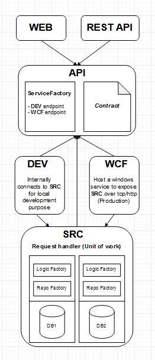

# SOLID

The purpose of this solution is to have everything ready, to start a new web based solution from scratch. The solution is based on SOLID design principals. There are five principles:

  - Single Responsibility Principle (SRP)

  - Open Closed Principle (OCP)

  - Liskov Substitution Principle (LSP)

  - Interface Segregation Principle (ISP)

  - Dependency Inversion Principle (DIP)

Technology stack: C#, .Net Framework 4.6, Rest API, WCF, Ninject, MSSQL, etc.

There are in total 8 projects in this solution.

API 
  - The contract.
  - ServiceFactory to determine which service end points (WCF, WCFIIS, DEV) to listen to via http or tcp protocol.

SRC
  - Default implementation of the API contract.
  - UnitOfWork, Databases, Repositories, Logics, Mappers, etc. 
  - Depends on API.

SRC.TEST
  - Unit test, integration test.
  - Depends on API, SRC.

WCF 
  - Host a WCF service to expose SRC via http or tcp protocol.
  - Depends on API, SRC.
  - Make sure to run this locally with Admin privilege.
  
  
WCFISS 
  - IIS hosted WCF service. (At the moment it is not exposing SRC). Only some dummy implementation of the API contract.
  - Depends on API.
  - Make sure to run this locally with Admin privilege.
  
  
DEV
  - This is the developers page. It has a reference to SRC and route all api requests internally to SRC.
  - Depends on API, SRC.
  

RESTAPI
  - This is the restful API implementation project. It can listen to WCF / WCFIIS / DEV.
  - Locally it is listening to WCF(http) project.
  - Depends on API.
  

WEB 
  - This is the public website. It can listen to WCF / WCFISS/ DEV.
  - Locally it is listening to DEV project.
  - Depends on API.
  
  
How to run locally

  - Create two databases "HelloWorld" and "LoremIpsum". Create tables HelloWorld => Cats, Dogs and LoremIpsum => Tigers. Each  table has only two columns (i.e., CatId, Color). Populate some default data.
  - Make sure to update the connection strings in WCF (App.config), DEV (Web.config), SRC.TEST (app.config) with your local database host address. 
